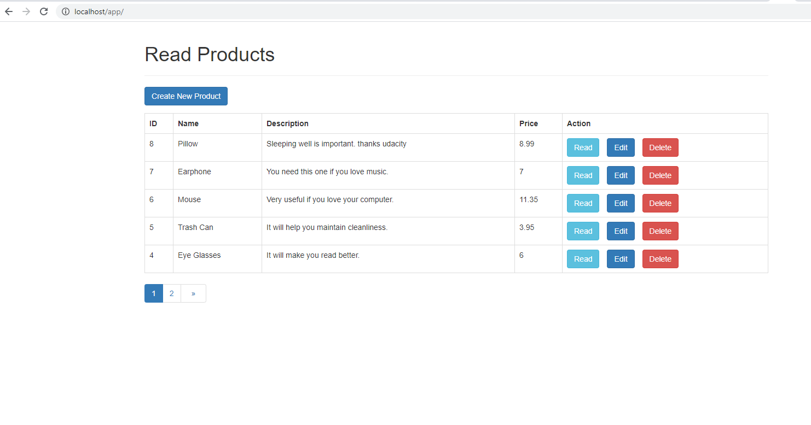

# PHP_PDO_CRUD


Next Level PHP (CRUD and pagination in 1day) PDO

for beter exp you can download laragon and phpmyadmin 

when you open phpmyadmin workbench click on import and import crud.sql

don't forget to rename simple_conifig.php to config.php

you cann use ```php $cfg['Servers'][$i]['AllowNoPassword'] = true; ``` to login without password 

visit localhost/phpmyadmin 
# /
user = root
password = (leave it empty)



